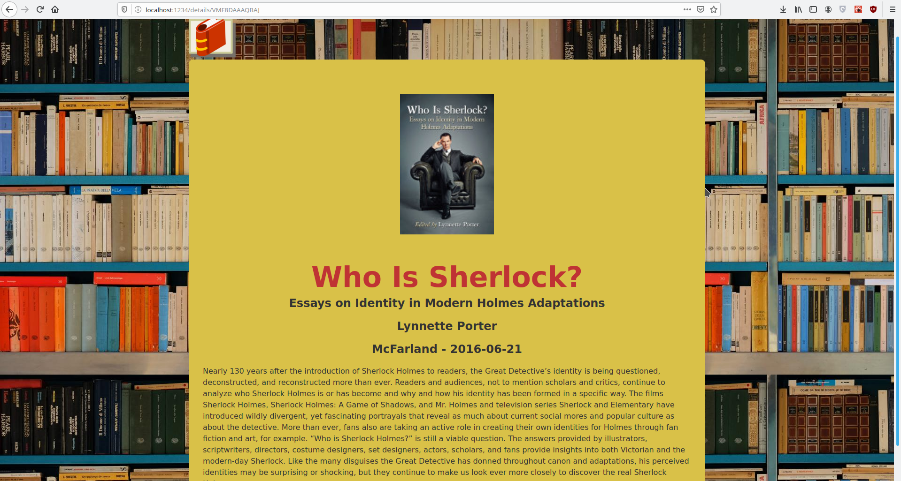
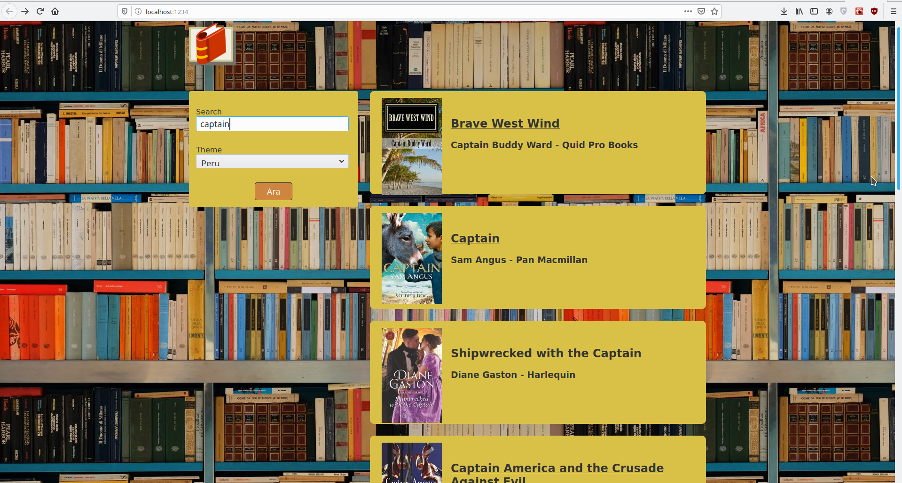
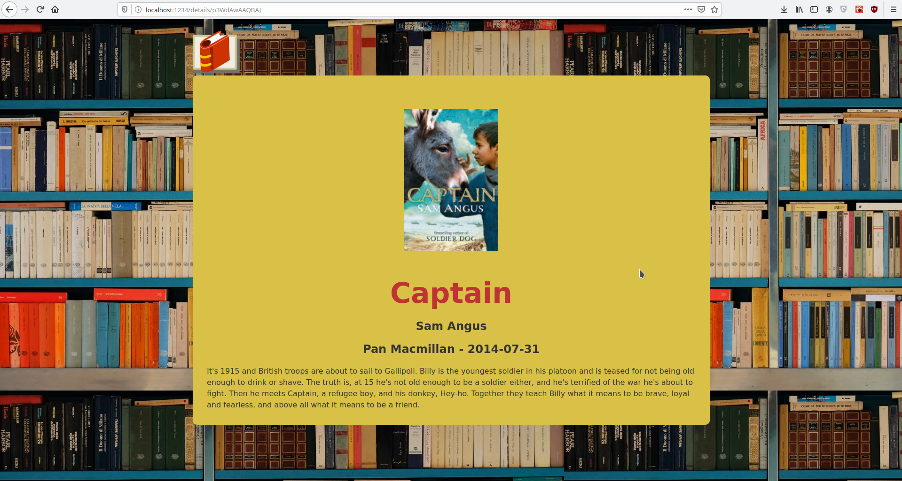

# MyLibraryJs with ReactJs and Parcel and GoogleBooks API

Basit bir aramalı kütüphane örneği.

Proje klasörünüzden, terminal ile:

### `npm install`

İle package.json dosyasında bulunan development ve project dependencies'leri indirin.

Kurulum tamamlandıktan sonra,

### `npm run dev`

İle uygulamayı development modunda çalıştırın.
Uygulamaya browser'da http://localhost:1234 yazarak ulaşabilirsiniz.

### `npm run format`

İle koda yenilikler eklemeden bir kere çalıştırın.
Bu prettier script'i olarak bütün src klasöründeki dosyaları
jsx formatında düzenler. Ayrıca Visual Studio Code kullanıyorsanız
bu eklentiyi indirmenizi şiddetle tavsiye ederim.

### Ekran Görüntüleri

